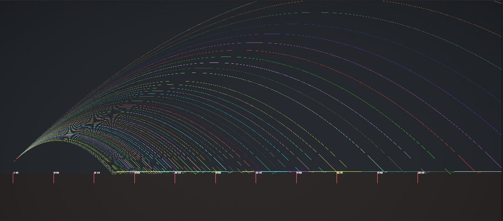
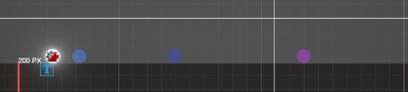

# Projectile Motion Simulator
This project is a Unity application that simulates the effect of gravity on a projectile. It allows users to adjust the force applied to the projectile and observe how changing gravity affects its trajectory.

## Features
- Adjustable Parameters: Users can change the force applied to the projectile and the strength of gravity to see how these factors affect its motion.

- Projectile Trail: A trail is displayed behind the projectile to visualize its path through the air.

- Realistic Gravity: The gravity applied to the projectile is based on real-world values, allowing for a more realistic simulation.

## How It Works
The project uses a ProjectileScript attached to the projectile GameObject to handle its movement and interaction with the environment. The script utilizes Unity's physics engine to apply forces to the projectile and simulate its motion.

## Projectile Motion
When the user triggers the projectile to be launched, the script calculates the force applied to the projectile based on the user-defined parameters. It then applies this force to the projectile's rigid body, causing it to move through the air.

## Gravity
The strength of gravity can be adjusted using the UI buttons or keyboard shortcuts. Changing the gravity affects the trajectory of the projectile, demonstrating how gravity influences the motion of objects in the real world.

## Projectile Trail
The trail behind the projectile is implemented using Unity's TrailRenderer component. This component automatically creates a trail behind the projectile as it moves, providing a visual representation of its path.

## Ghost Projectiles
When the Projectile is reset, it leaves behind a trail & also a ghost variant of it's self with its position.

## Getting Started
To run the project, simply open it in the Unity editor and press play. Use the UI buttons or keyboard shortcuts to adjust the force and gravity and observe how they affect the projectile's motion.

## Contributing
If you'd like to contribute to this project, feel free to fork the repository and submit a pull request with your changes. Any contributions are welcome!

## License
This project is licensed under the MIT License - see the LICENSE.md file for details.